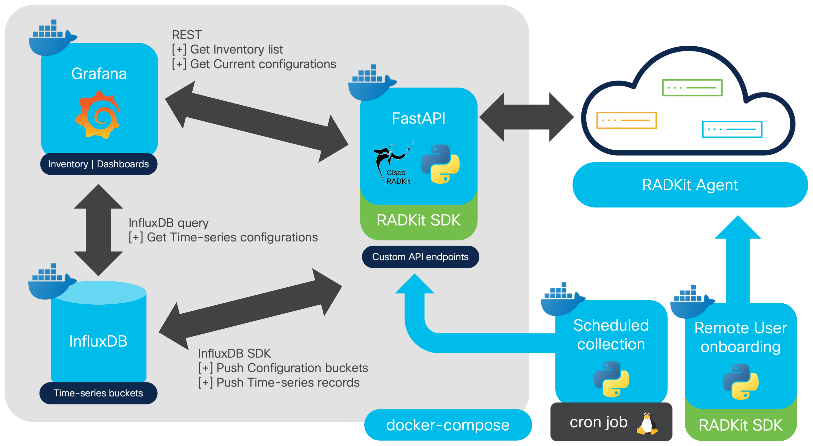

# ✨📊📈📉🤖 RADKit-to-Grafana Dashboard Framework

⚠️ This is a work in progress! ⚠️

> **Disclaimer**: The screenshot above represents a possible Use Case of the framework in this repository. This is not an out-of-the-box state.

Containerised framework for the creation of dashboards (current configurations, time-series) based on the interaction with a Cisco RADKit agent and it's inventory devices.

## 📝 Project Description

The "RADKit-to-Grafana Dashboard Framework" project provides a framework to gain insights into any kind of information from our network infrastructure. By leveraging RADKit for device interaction, InfluxDB for time-series data storage, and Grafana for visualization, the solution allows for continuous monitoring of configurations of interest. Through python coding, this frameworks provides opportunities for data analysis and correlation, which can aid in strategic decision-taking for our infrastructure configurations.

## 🏗️ Architecture



The solution is containerized using Docker Compose and comprises the following services:

*   🧲 **`fastapi-middleware`**: A Python-based FastAPI server that acts as a crucial intermediary. It provides API endpoints for interacting with the RADKit service (e.g., retrieving device inventory, fetching interface details, and measuring power consumption). This service bridges the data flow between RADKit and the InfluxDB/Grafana stack.

*   📊 **`grafana`**: A Grafana container responsible for visualizing the collected information - real-time monitoring and historical analysis.

*   📈 **`influxdb`**: An InfluxDB database container configured for time-series data storage.

Additionally, the following stand-alone tools are available:

*   🧑‍💻 **`radkit-client-onboarding`**: A container utility for onboarding the specified user into the RADKit cloud for non-interactive authentication. This generates a series of certificate files that are later used for automated authentication in the RADKit agent.

*   ⏰ **`radkit-to-grafana-collection-scheduler`**: A cron job-based scheduler that periodically triggers FastAPI endpoints of interest. This scheduler, optimized with a Python container utilizing threading, ensures efficient time-series data collection from RADKit and pushes it to InfluxDB.

## ⚙️ Setup

### 📋 Prerequisites

Before you begin, ensure you have the following installed:

*   [Docker](https://docs.docker.com/get-docker/)
*   [Docker Compose](https://docs.docker.com/compose/install/) (usually included with Docker Desktop)

### 🔑 Configuration
#### 1. Remote User addition
Your Cisco RADKit Agent must have at least one user added to the **Remote Users** section. The user must be active. For instructions on how to do this, check the [RADKit official documentation - Adding remote users](https://radkit.cisco.com/docs/quick_start_guide.html#adding-remote-users).

#### 2: Clone this repository
Issue the following command to clone this repository in your host computer:

```
git clone https://github.com/ponchotitlan/radkit-to-grafana-dash.git
```

#### 3. `config.yaml` file details
Next, you need to configure the `radkit-to-grafana-config/config.yaml` file with your RADKit Agent details.

1.  Navigate to the `radkit-to-grafana-config/` directory.
2.  Edit `config.yaml` and populate the following fields with your specific RADKit server information:

    ```yaml
    radkit-config:
      server-host: <YOUR_RADKIT_SERVER_HOST>
      server-port: <YOUR_RADKIT_SERVER_PORT>
      radkit-service-username: <YOUR_RADKIT_REMOTE_USERNAME>
      radkit-service-code: <YOUR_RADKIT_SERVICE_CODE>
    ```

#### 4. Onboard your user for non-interactive authentication
Finally, issue the command ```make onboard``` from the base directory of this repository. This will trigger a container utility for onboarding the Remote User that you provided in the yaml file above into the RADKit cloud for password-less authentication.

```
make onboard
```

```
docker build -f radkit-to-grafana-client-onboarding/Dockerfile -t radkit-client-onboarding .
[+] Building 78.8s (11/11) FINISHED
 => [internal] load build definition from Dockerfile
. . .
 => [5/5] COPY radkit-to-grafana-client-onboarding/. /app 
 => exporting to image 
 => => exporting layers 
 => => writing image sha256:b833c46abdd7d97a498d4301d2a562c30445de27d847ad43af49c175781f186e 
 => => naming to docker.io/library/radkit-client-onboarding 

docker run -it --rm \
                -v "/radkit-to-grafana-dash/radkit-to-grafana-agent-config:/radkit-to-grafana-agent-config" \
                radkit-client-onboarding

--- ✨🔑✨ Onboarding user (radkit_remote_user@cisco.com) into the RADKit Cloud for non-interactive authentication ---

---⚠️👇 A link will appear down below on short. Please click it or copy/paste in your web browser 👇⚠️ ---

    https://id.cisco.com/oauth2/default/v1/authorize?response_type=code&client_id=radkit_prod&redirect_uri...

New private key password: *********
Confirm: *********
The private key is a very sensitive piece of information. DO NOT SHARE UNDER ANY CIRCUMSTANCES, and use a very strong passphrase. Please consult the documentation for more details.
<frozen radkit_client.async_.client>:891: UserWarning: The private key is a very sensitive piece of information. DO NOT SHARE UNDER ANY CIRCUMSTANCES, and use a very strong passphrase. Please consult the documentation for more details.

---------------------------------------------------------------------------------------
✅📁🔑 Successfully copied '/root/.radkit/identities' to '/radkit-to-grafana-agent-config/identity-files/identities' in this repository!
You are now ready to mount the radkit-to-grafana environment.
👉 Issue the command `make` to build and run the system. Provide the password that you used in this setup.
---------------------------------------------------------------------------------------
```

#### 5. Create your own RADKit API endpoints
Now comes your time to code! The definition of your API endpoints for populating the Grafana dashboards go in the `radkit-to-grafana-fastapi-middleware/main.py` file.

👉 For a detailed guide on how to develop these endpoints, please check [this guide]().


### 🚀 Running the Services

| Target | Description |
|---|---|
| `all` | Builds the Docker image and then sets up and runs the radkit-to-grafana services. This is the default target. |
| `build` | Builds the Docker image named `fastapi-middleware` using the Dockerfile located in the `radkit-to-grafana-fastapi-middleware/` directory. |
| `run` | Prompts you for the password of the RADKit onboarded user, and then starts the Docker Compose services defined in `docker-compose.yaml` in detached mode, waiting for them to be healthy. |
| `stop` | Stops all the containers without deleting them. |
| `clean` | Cleans up the environment by bringing down the Docker Compose services, removing the `fastapi-middleware` Docker image, and deleting the temporary secret file. |
| default | A composite target that first executes `build` to create the Docker image, and then executes `run` to set up and start the radkit-to-grafana services. |

#### Example of usage for the first time

```
make
```

> When using `make` or `make run`, you are prompted for a password. This is the password that you setup before in the onboarding process, aka when running `make onboard`.

```
--- 🏗️ Building the fastapi-middleware image ---
docker build -t fastapi-middleware radkit-to-grafana-fastapi-middleware/
[+] Building 1.8s (11/11) FINISHED
 => [internal] load build definition from Dockerfile
. . .
. . .
. . .
-------------------------------------------------------------------
--- 🚀 Setting up the radkit-to-grafana services ---
🔑 Enter the Private Key password of 'radkit-service-username' from your config.yaml file:
[+] Running 4/4
 ✔ Network radkit-to-grafana-app-network                       Created
 ✔ Container radkit-to-grafana-fastapi-middleware-1            Healthy 
 ✔ Container grafana                                           Healthy
 ✔ Container influxdb                                          Healthy
-------------------------------------------------------------------
--- ✅ radkit-to-grafana services up and running! ---
-------------------------------------------------------------------
```

## 💡 Usage

### 📊 Accessing Grafana

Once the services are up and running, Grafana will be accessible via your web browser:

*   **URL**: `http://localhost:3000`

You can find a default Grafana dashboard with device inventory and device interfaces pick lists on top.

### ✨📈📉 Creating your own Grafana dashboards

👉 To create your own dashboards based on your previously created API endpoints, please [follow this guide]().

### ⏰ Setting up Data Collection (Cron Job)

The project includes a collection scheduler that uses a cron job to periodically collect data from RADKit via the FastAPI middleware and push it to InfluxDB.

1.  Navigate to the `radkit-to-grafana-collection-scheduler/` directory:

    ```bash
    cd radkit-to-grafana-collection-scheduler/
    ```

2.  To **add or update** the cron job, you need a `schedule.yaml` file defining the desired cron schedule. An example `schedule.yaml` might look like this to run every 5 minutes:

    ```yaml
    # schedule.yaml
    cron_schedule: "*/5 * * * *"
    ```

3.  Run the `create-cron-collection.sh` script to add or update the cron job:

    ```bash
    ./create-cron-collection.sh add schedule.yaml
    ```

4.  To **remove** the existing cron job created by this script:

    ```bash
    ./create-cron-collection.sh remove
    ```