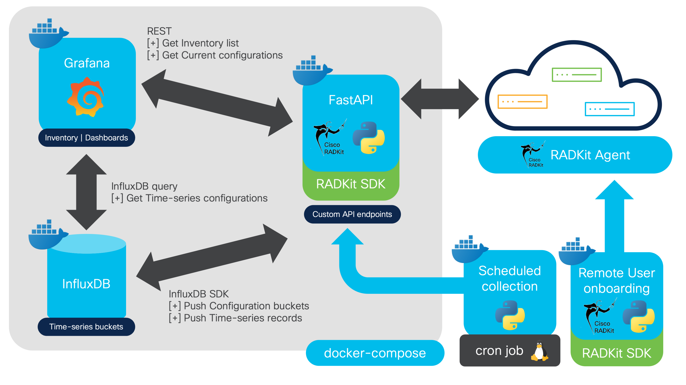

<h1 align="center">✨📊📈📉🤖 RADKit-to-Grafana Dashboard Framework<br /><br />
<div align="center">

</div>

<div align="center">
  
  
  
  
  <a href="https://developer.cisco.com/codeexchange/github/repo/ponchotitlan/radkit-to-grafana-dash"></a>
</div></h1>

<div align="center">
A containerized framework to create dynamic Grafana dashboards (for current configurations and time-series data) by interacting with Cisco RADKit servers and network devices.<br /><br />
</div>


> **Disclaimer**: The screenshot above represents a possible Use Case of the framework in this repository.

## 📝 Project Overview

This project, "RADKit-to-Grafana Dashboard Framework," helps you gain deep insights into your network infrastructure. It integrates **RADKit** for device interaction, **InfluxDB** for time-series data storage, and **Grafana** for powerful visualizations. This allows for continuous monitoring of network configurations and provides a foundation for data analysis and correlation, aiding in strategic infrastructure decisions.

## 🏗️ Architecture



The solution is containerized using Docker Compose and comprises the following services:

*   🧲 **`fastapi-middleware`**: A Python FastAPI server that acts as the central bridge. It provides API endpoints to interact with RADKit and facilitates data flow to InfluxDB and Grafana.

*   📊 **`grafana`**: A Grafana container for visualizing collected data, enabling real-time monitoring and historical analysis.

*   📈 **`influxdb`**: An InfluxDB database container specifically for time-series data storage.

Additionally, these stand-alone tools are included:

*   🧑‍💻 **`radkit-client-onboarding`**: A utility to onboard your user to the RADKit cloud for non-interactive (password-less) authentication, generating necessary certificate files.

*   ⏰ **`radkit-to-grafana-collection-scheduler`**: A cron job-based scheduler (Python container with threading) that periodically triggers FastAPI endpoints to efficiently collect time-series data from RADKit and push it to InfluxDB.

## ⚙️ Setup

### 📋 Prerequisites

Before you begin, ensure you have the following installed:

*   [Docker](https://docs.docker.com/get-docker/)
*   [Docker Compose](https://docs.docker.com/compose/install/) (usually included with Docker Desktop)

> This framework is intended for **Linux-based OS hosts**, and has been successfully tested in `macOS` and various Linux distributions. The utilities use `Makefile` targets which are not compatible with Windows systems.

### 🔑 Configuration
#### 1. Add a Remote User to RADKit
Ensure your Cisco RADKit server has at least one active user in the **Remote Users** section. Refer to the [RADKit official documentation - Adding remote users](https://radkit.cisco.com/docs/quick_start_guide.html#adding-remote-users) for details.

#### 2: Clone this repository
Issue the following command to clone this repository in your host computer:

```bash
git clone https://github.com/ponchotitlan/radkit-to-grafana-dash.git
```

#### 3. Configure `config.yaml`
Edit the `radkit-to-grafana-config/config.yaml` file with your RADKit server details:

```yaml
radkit-config:
  server-host: <YOUR_RADKIT_SERVER_HOST>
  server-port: <YOUR_RADKIT_SERVER_PORT>
  radkit-service-username: <YOUR_RADKIT_REMOTE_USERNAME>
  radkit-service-code: <YOUR_RADKIT_SERVICE_CODE>
```

#### 4. Onboard User for Non-Interactive Authentication
Run `make onboard` from the repository's base directory. This command uses a container utility to onboard the Remote User (specified in your `config.yaml`) to the RADKit cloud, enabling password-less authentication.

```bash
make onboard
```

Follow the prompts, including providing a password for your new private key. This process generates certificate files needed for automated authentication.
Upon successful completion, you'll see a message confirming the identity files are copied, indicating you're ready to proceed.

```
docker build -f radkit-to-grafana-client-onboarding/Dockerfile -t radkit-client-onboarding .
docker run -it --rm \
                -v "/radkit-to-grafana-dash/radkit-to-grafana-config:/radkit-to-grafana-config" \
                radkit-client-onboarding

--- ✨🔑✨ Onboarding user (radkit_remote_user@cisco.com) into the RADKit Cloud for non-interactive authentication ---

---⚠️👇 A link will appear down below on short. Please click it or copy/paste in your web browser 👇⚠️ ---

    https://id.cisco.com/oauth2/default/v1/authorize?response_type=...

New private key password: *********
Confirm: *********
. . .

---------------------------------------------------------------------------------------
✅📁🔑 Successfully copied '/root/.radkit/identities' to '/radkit-to-grafana-config/identity-files/identities' in this repository!
You are now ready to mount the radkit-to-grafana environment.
👉 Issue the command `make` to build and run the system. Provide the password that you used in this setup.
---------------------------------------------------------------------------------------
```

#### 5. Develop Your RADKit API Endpoints
Define your custom API endpoints for populating Grafana dashboards within the `radkit-to-grafana-fastapi-middleware/main.py` file.

👉👉 For a detailed guide on developing these endpoints, refer to [this guide](https://github.com/ponchotitlan/radkit-to-grafana-dash/wiki/01-API-endpoints-for-RADKit).

### 🚀 Running the Services

| Target | Description |
|---|---|
| `all` | Builds the Docker image and then sets up and runs the radkit-to-grafana services. This is the default target. |
| `build` | Builds the Docker image named `fastapi-middleware` using the Dockerfile located in the `radkit-to-grafana-fastapi-middleware/` directory. |
| `run` | Prompts you for the password of the RADKit onboarded user, and then starts the Docker Compose services defined in `docker-compose.yaml` in detached mode, waiting for them to be healthy. |
| `stop` | Stops all the containers without deleting them. |
| `clean` | Cleans up the environment by bringing down the Docker Compose services, removing the `fastapi-middleware` Docker image, and deleting the temporary secret file. |
| default | A composite target that first executes `build` to create the Docker image, and then executes `run` to set up and start the radkit-to-grafana services. |

#### First-Time Usage Example
To build and run all services for the first time, simply run:

```bash
make
```

When running `make` or `make run`, you will be prompted for the private key password you set during the `make onboard` process.

A successful startup will show output similar to this:

```
--- 🏗️ Building the fastapi-middleware image ---
docker build -t fastapi-middleware radkit-to-grafana-fastapi-middleware/
-------------------------------------------------------------------
--- 🚀 Setting up the radkit-to-grafana services ---
🔑 Enter the Private Key password of 'radkit-service-username' from your config.yaml file:
[+] Running 4/4
 ✔ Network radkit-to-grafana-app-network                       Created
 ✔ Container radkit-to-grafana-fastapi-middleware-1            Healthy 
 ✔ Container grafana                                           Healthy
 ✔ Container influxdb                                          Healthy
-------------------------------------------------------------------
--- ✅ radkit-to-grafana services up and running! ---
-------------------------------------------------------------------
```

## 💡 Usage

### 📊 Accessing Grafana

Once the services are up and running, Grafana will be accessible via your web browser:

```bash
http://localhost:3000
```

### ✨📈📉 Creating your own Grafana dashboards

👉👉 Learn how to build your own Grafana dashboards using your custom API endpoints by following [this guide](https://github.com/ponchotitlan/radkit-to-grafana-dash/wiki/02-Grafana-dashboard).

### ⏰ Setting up Data Collection (Cron Job)

👉👉 To set up a cron job for scheduled data collection (periodically invoking your FastAPI endpoints for time-series visualizations), refer to [this guide](https://github.com/ponchotitlan/radkit-to-grafana-dash/wiki/03-Data-Collection-(Cron-Job)).

---

<div align="center"><br />
    Made with ☕️ by Poncho Sandoval - <code>Developer Advocate 🥑 @ DevNet - Cisco Systems 🇵🇹</code><br /><br />
    <a href="mailto:alfsando@cisco.com?subject=Question%20about%20[RADKIT%20Grafana]&body=Hello,%0A%0AI%20have%20a%20question%20regarding%20your%20project.%0A%0AThanks!">
        
    </a>
    <a href="https://github.com/ponchotitlan/radkit-to-grafana-dash/issues/new">
      
    </a>
    <a href="https://github.com/ponchotitlan/radkit-to-grafana-dash/fork">
      
    </a>
</div>
